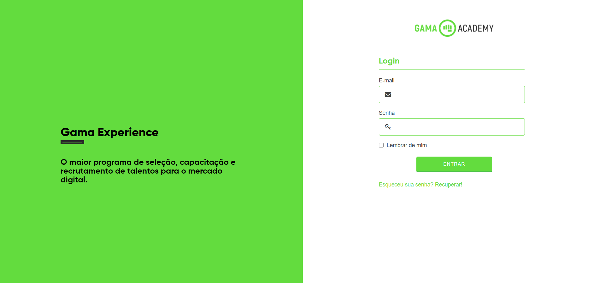

# Gama Experience

## 💻 About

This is a recreation of the Gama Experience login page. The purpose of this exercise is to put into practice some of the skills learned during the [Hiring Coders](https://www.hiringcoders.com.br/) training program.

## 🎨 Layout

[Original layout](https://xp.gama.academy/)

## ⚙️ Features

- [x] Email field asks for a valid email address.
- [x] Password field must be longer than 8 characters.
- [x] Responsive layout.

## 🛠 Tecnologias

- HTML
- CSS

## 🦸 Author

   
 

## 📝 License

This project is under license [MIT](./LICENSE).

Made with ❤️ by Criptograma 👋🏽 [Contact!](https://www.linkedin.com/in/andresa-cristina/)

